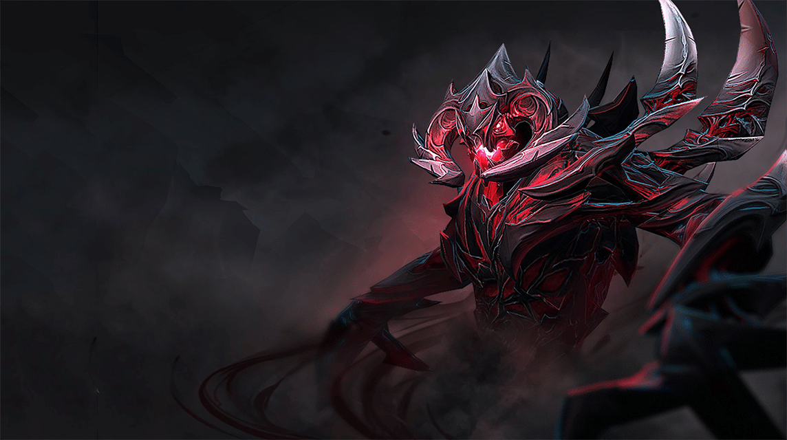

# Dota 2 
[Ссылка на игру]()\
**Жанр**: многопользовательская онлайновая боевая арена\
**Разработчик**: Аня\
**Описание**: многопользовательская командная компьютерная игра в жанре MOBA, разработанная и изданная корпорацией Valve. Игра является продолжением DotA — пользовательской карты-модификации для игры Warcraft III: Reign of Chaos и дополнения к ней Warcraft III: The Frozen Throne. \

**Системные требования(минимальные):**

|требование |характеристика                           |
|-          |-                                        |
|OS         |Windows XP/Vista/Windows 7/Windows 8     |
|Processor  |1.7+ GHz or better                       |
|Memory     |1+ gigs of RAM GB RAM                    |
|Graphics   |Radeon HD5450 or better; 256 MB or higher|
|DirectX®   |9.0c                                     |
|Hard Drive |500 MB HD space                          |
|Sound      |100% DirectX9.0c compatible sound card and drivers|

**Ключевые особенности:**
- Занимательное времяприпровождение в окружении дружелюбных игроков.
- Исключительный гемплей, хранящий в себе множество механик и тактик боя.
- Новые события, дополняющие атмосферу мистики и фэнтези героев.

**О разработчике:**
Идея о создании такой великой игры, как Dota 2, настигла меня внезапно. Мысль о уединении людей в сказочном Мире волшебства и магии заставила моё сознание воплотить все описанные чудеса в Мир бытия. 

(https://avatars.dzeninfra.ru/get-zen_doc/8291287/pub_645fa1a1431d8c20993daf24_645fa277c4e39a372a11232e/scale_1200) \
(https://static.wikia.nocookie.net/dota2_gamepedia/images/7/78/Keyart_phoenix.jpg/revision/latest/scale-to-width-down/1200?cb=20140130010111) \([https://img.itch.zone/aW1nLzYwMzUzMzEuZ2lm/original/U36zqc.gif](https://cq.ru/storage/uploads/images/1024555/1920x1080-px-dota-dota-2-rubick-rubick-the-grand-magus-686339.jpg)
```python
print(Игра сделана на Python :) )
```
